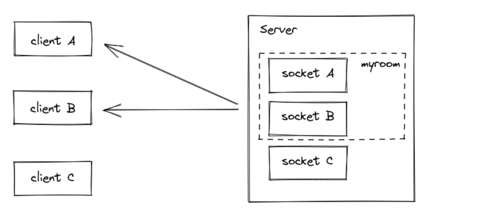

# Message Queues

## Socket.io Chat Example

The first goal is to set up a simple HTML webpage that serves out a form and a list of messages. We’re going to use the Node.JS web framework express to this end. Make sure Node.JS is installed.

First let’s create a package.json manifest file that describes our project. I recommend you place it in a dedicated empty directory (I’ll call mine chat-example).

{
  "name": "socket-chat-example",
  "version": "0.0.1",
  "description": "my first socket.io app",
  "dependencies": {}
}

### Broadcasting

And on the client side when we capture a chat message event we’ll include it in the page. The total client-side JavaScript code now amounts to:

< script src="/socket.io/socket.io.js"></script>
< script>
  var socket = io();

  var messages = document.getElementById('messages');
  var form = document.getElementById('form');
  var input = document.getElementById('input');

  form.addEventListener('submit', function(e) {
    e.preventDefault();
    if (input.value) {
      socket.emit('chat message', input.value);
      input.value = '';
    }
  });

  socket.on('chat message', function(msg) {
    var item = document.createElement('li');
    item.textContent = msg;
    messages.appendChild(item);
    window.scrollTo(0, document.body.scrollHeight);
  });
</script>

## Rooms

A room is an arbitrary channel that sockets can join and leave. It can be used to broadcast events to a subset of clients:

### Joining and leaving

- joining
you can call join to subscribe the socket to a given channel:

io.on("connection", (socket) => {
  socket.join("some room");
});
And then simply use to or in (they are the same) when broadcasting or emitting:

io.to("some room").emit("some event");
You can emit to several rooms at the same time:

io.to("room1").to("room2").to("room3").emit("some event");

- leaving
To leave a channel you call leave in the same fashion as join.

## Namespace

A Namespace is a communication channel that allows you to split the logic of your application over a single shared connection (also called "multiplexing").

Each namespace has its own:

- event handlers
- rooms
- middlewares

Possible use cases:

you want to create a special namespace that only authorized users have access to, so the logic related to those users is separated from the rest of the application
const adminNamespace = io.of("/admin");

adminNamespace.use((socket, next) => {
  // ensure the user has sufficient rights
  next();
});

adminNamespace.on("connection", socket => {
  socket.on("delete user", () => {
    // ...
  });
});
