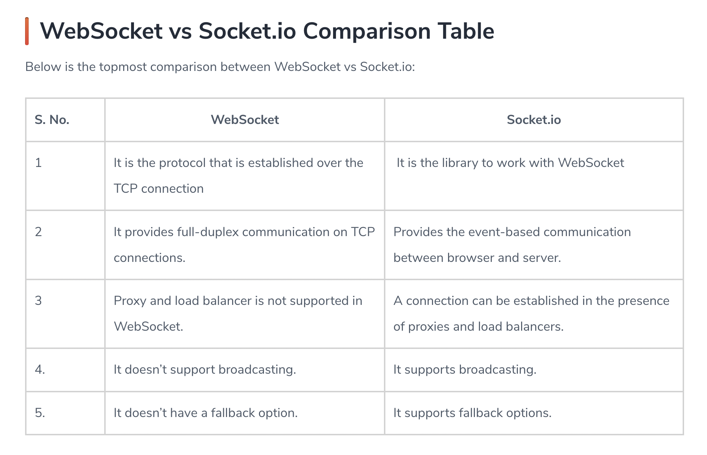

# Socket.io

- WebSocket is a computer communications protocol, providing full-duplex communication channels over a single TCP connection.
- The WebSocket protocol enables interaction between a web browser (or other client application) and a web server with lower overhead than half-duplex alternatives such as HTTP polling, facilitating real-time data transfer from and to the server.

## Protocol handshake

To establish a WebSocket connection, the client sends a WebSocket handshake request, for which the server returns a WebSocket handshake response.
Client request (just like in HTTP, each line ends with \r\n and there must be an extra blank line at the end):

GET /chat HTTP/1.1
Host: server.example.com
Upgrade: websocket
Connection: Upgrade
Sec-WebSocket-Key: x3JJHMbDL1EzLkh9GBhXDw==
Sec-WebSocket-Protocol: chat, superchat
Sec-WebSocket-Version: 13
Origin: [example](http://example.com)

## Socket.IO

Socket.IO is a JavaScript library for real-time web applications. It enables real-time, bi-directional communication between web clients and servers. It has two parts − a client-side library that runs in the browser, and a server-side library for node.js. Both components have an identical API.

### Some examples of real-time applications are

- Instant messengers − Chat apps like Whatsapp, Facebook Messenger, etc. You need not refresh your app/website to receive new messages.

- Push Notifications − When someone tags you in a picture on Facebook, you receive a notification instantly.

- Collaboration Applications − Apps like google docs, which allow multiple people to update same documents simultaneously and apply changes to all people's instances.

- Online Gaming − Games like Counter Strike, Call of Duty, etc., are also some examples of real-time applications.

### Why Socket.IO?

Writing a real-time application with popular web applications stacks like LAMP (PHP) has traditionally been very hard. It involves polling the server for changes, keeping track of timestamps, and it is a lot slower than it should be.

Sockets have traditionally been the solution around which most real-time systems are architected, providing a bi-directional communication channel between a client and a server. This means that the server can push messages to clients. Whenever an event occurs, the idea is that the server will get it and push it to the concerned connected clients.

- Socket.IO is used by Microsoft Office, Yammer, Zendesk, Trello. It one of the most powerful JavaScript frameworks on GitHub, and most depended-upon NPM module.

## Socket.io vs Web Sockets

