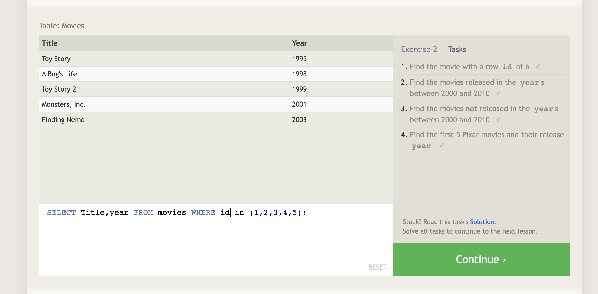
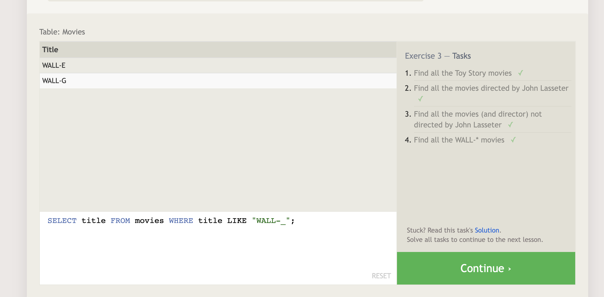
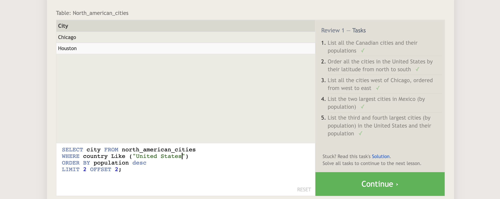
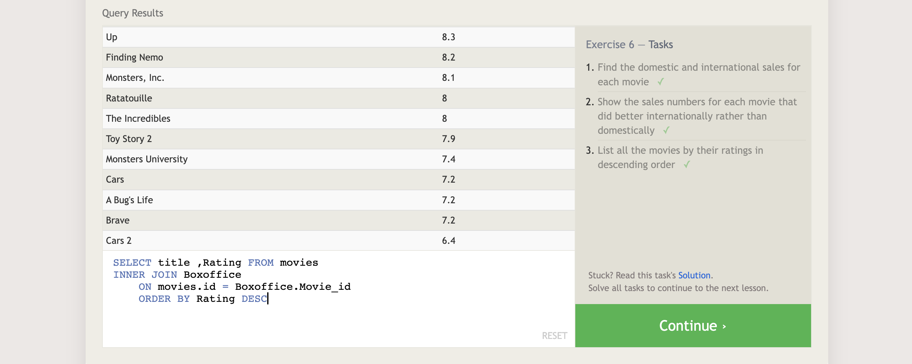
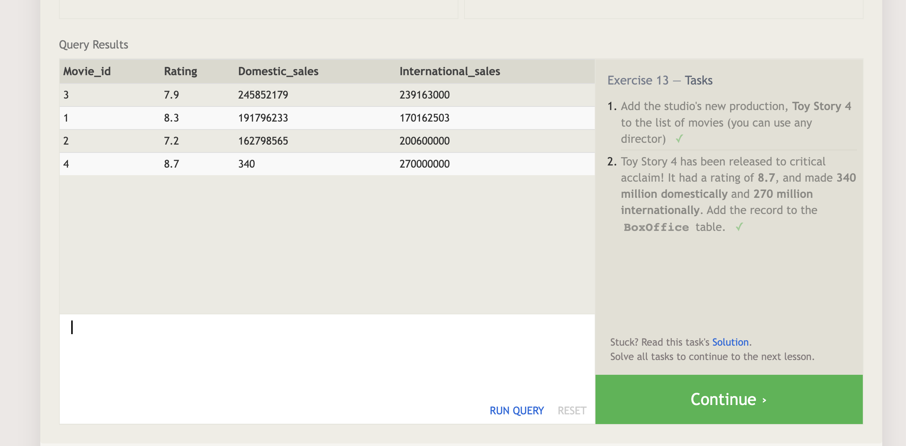
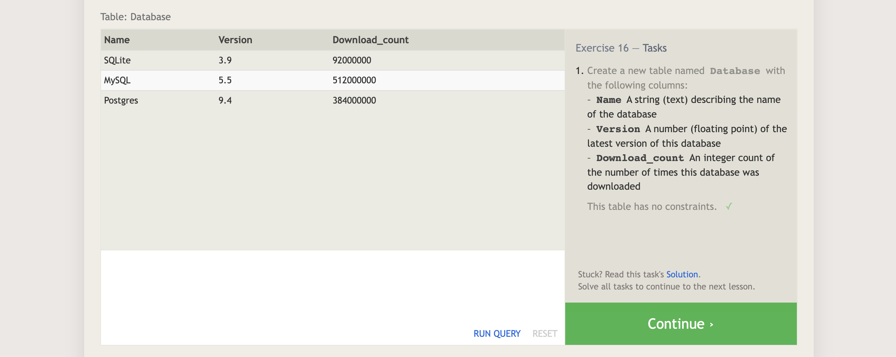
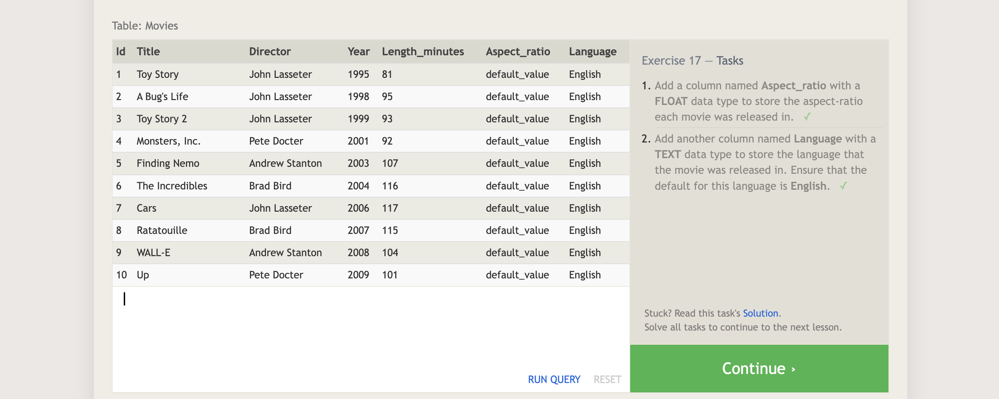

# Summarize SQL and Relational Database

- SQL: Structured Query Language, used to communicate with a relational database.
and allow you to Select (find), Insert (add), Update (change), and Delete (remove) a large amount of data.
SQL databases provide safe and scalable storage for a lot of websites and mobile app.

- Relational Database: is a database organized according to the relational model of data and represents a collection of related (two-dimensional) tables.
 Using a relational database helps us to cut down on duplicated data and provides a much more useful data structure for us to interact with.

## Screenshot for SQL lessons

